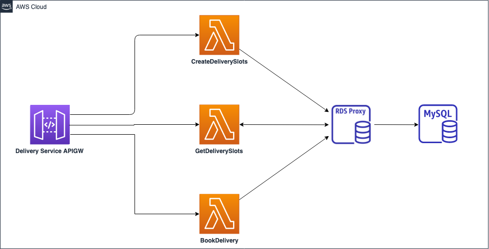
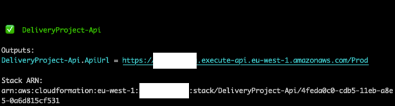

# Home Delivery Application

This solution demonstrates how to create an API backed by Lambda function handlers, using CDK in Java. The solution accompanies blog posts from the [I Love My Local Farmer Engineering Blog](https://medium.com/i-love-my-local-farmer-engineering-blog). 

This README.md contains only architecture, installation steps, and technical note for development. For more details, please check posts in the blog series. 
 
 * [Part 1](https://medium.com/i-love-my-local-farmer-engineering-blog/the-strawberrys-journey-from-your-local-farm-to-your-table-70e80b5a4f51) explains business requirements and the context of the project
 * [Part 2](https://medium.com/i-love-my-local-farmer-engineering-blog/a-serverless-java-solution-for-deliveries-2a29497ca272) discusses architecture and the trade-off decisions we made when choosing to use certain AWS services and frameworks
 * Part 3 discusses writing CDK code in Java
                             

# Pre-requisites
1. **AWS CLI v2:** with AWS credentials configured (See steps [here](https://docs.aws.amazon.com/cdk/latest/guide/getting_started.html#getting_started_prerequisites))
1. **AWS CDK (v. 1.102.0 or higher):** for infrastructure and code deployment (See installation steps [here](https://docs.aws.amazon.com/cdk/latest/guide/getting_started.html#getting_started_install)  
1. **Docker** For bundling code into a Lambda package
1. **Java 11** If you haven't installed this version before, you can use [Amazon Corretto 11 distribution](https://aws.amazon.com/corretto/)
1. **Gradle** For building Java code ([Installation step](https://gradle.org/install/))


# Architecture



# Code Structure
The code contains two main folders:

1. `ApiHandlers` contains all Java code for Lambda functions
1. `cdk` contains all Java code for infrastructure, including two stacks
    1. `DbStack` contains the MySQL RDS instance, RDS proxy and other required resources for using RDS (e.g. secret stores to keep DB credentials, IAM Role and Policy, VPC and network resources)
    1. `ApiStack` contains the API Gateway, Lambda functions, and a custom resource to populate DB tables and users in the database.  

# Installation steps

1. Run `aws configure` to set up your profile and default region.

1. Run `npx cdk bootstrap aws://[AWS_ACCOUNT_ID]/[REGION] --profile <PROFILE_NAME>` if you haven't run it before in the target region. 

1. (Windows users only) Your Git client may change line break from LF to CRLF. This will breaks the Gradle build that will happen inside a Docker container (See [details](https://stackoverflow.com/questions/22301956/error-with-gradlew-usr-bin-env-bash-no-such-file-or-directory)). You can check if this is the case for you by running this command:
    ```
   git config --get core.autocrlf
   ```
   If this value is true, open `cdk/gradlew` and change the last line break of the file into LF.

1. Run these commands to deploy:

    Bash on Linux or Mac
    ```
    cd cdk
    rm -rf target ../ApiHandlers/build cdk.out # Remove previous build or the synth will fail
    npx cdk deploy --all --profile <PROFILE_NAME> 
    ```

    Powershell on Windows
    ```
    cd cdk
    rm -r target ../ApiHandlers/build # Remove previous build or the synth will fail
    rm -r ../ApiHandlers/build # Remove previous build or the synth will fail
    rm -r cdk.out # Remove previous build or the synth will fail
    npx cdk deploy --all --profile <PROFILE_NAME> 
    ```

    The deployment can take up to an hour. It will create two CloudFormation stacks. `DeliveryProject-Db` and `DeliveryProject-Api`. The stacks are defined in `DeliveryApp.java`.

    You will be first prompted to accept the changes for the `DeliveryProject-Db` stack. About 30 minutes later, when this stack will be deployed, you will be prompted to accept the changes for the `DeliveryProject-Api` stack.
    
    The output of the API stack includes an API URL for testing. You can find example commands for testing it in the "API testing" section.
    

# Note for extending/reusing this solution 

## Deploy database in public subnet for development

By default, the deployment will put the RDS instance in the private subnets of a VPC. If you wish to deploy the database to public subnets for the purposes of testing queries using a connection from your local machine, 
add the following context variable to the deployment command `--c subnetType=public`.

Example:
```
npx cdk deploy --all --profile <PROFILE_NAME> --c subnetType=public
```
## CORS
Please note that in our code we have a development setup for allowing CORS requests from '*'.
```
CfnApi apiGw =
    new CfnApi(
        ...
        .cors(
            // In production, limit this to only your domain name
            CfnApi.CorsConfigurationProperty.builder()
                .allowOrigin("'*'")
                .allowHeaders("'*'")
                .allowMethods("'*'")
                .build())
```

You should change the settings according to your business needs, but at a bare minimum you should limit the Origin to your domain in your Production environment.

## Using local AWS CDK CLI
Notice that the example commands use `npx cdk [command]`. 

For those who aren't familiar with `npx`, it runs the specified command (`cdk`) through Node Package Manager (npm). `npx` will check first if there is any project-level or local installation of CDK.  If not, it will download CDK with the latest version or exact version (e.g. 1.102.0) if specified and execute it.  

You can install CDK in your local machine by running `npm install -g cdk`.  By doing so, you can simply run `cdk` instead. But please note that you will use this version of CDK globally. 

We recommend using the same CDK version or higher as the CDK construct libraries (found in `cdk/gradle.build`). This is to avoid issues from incompatible versions.    

## Running and developing locally
We have two Gradle projects, `ApiHandlers` and `cdk`. The `cdk` project includes a build script to build `ApiHandlers` so you do not need to build them separately and can deploy everything in a single command (See installation steps).

When you develop this locally, you can get faster cycle of build and unit tests (without deploying anything) by running `./gradlew [target]`. For example:

```
./gradlew test # Run unit tests
``` 

## CDK Snapshot Testing 
As there is no equivalent of the `cdk-assert` library in Java. Our `cdk` project uses [json-snapshot](https://json-snapshot.github.io/) to perform snapshot testing. The tests are in `DeliveryAppTest.java`.

The test ensures that the CDK code can be successfully synthesized, providing a sanity check before pushing your code. In addition, it generates `DeliveryAppTest.snap` which gets committed to the Git repository. The PR reviewers can check this file to ensure that no unintended changes get introduced in a PR.

When you intentionally change the infrastructure, you have to delete the old snapshot. Otherwise, the tests will fail with a `SnapshotMatchException`.  This project deletes the old snapshot automatically in the task `removeSnapshot` in `cdk/gradle.build` file. Note that the `test` target depends on this, so it is always run before testing and/or building. 

We decided to do this to avoid failing the test for every change when developing locally. Your team may decide to remove this task dependency and force developers to remove the snapshot manually as an extra safeguard against making unintended changes in dev accounts.

## Running `cdk diff` before deployment

 We **highly** recommend that you run a diff on the resources in your account before deploying when making changes to infrastructure code.
 This can be accomplished by running the following command when you have credentials for the account you intend to deploy to,
  		  
 ```npx cdk diff```
  
 This will allow you to see any changes that will occur in your account before you deploy them, potentially preventing any
 accidental modifications and/or deletions.

 
## API testing

The API is open to public, so you can directly call it to test. Here are some examples using CURL with a sample payload.

* Note if testing the Get Slots API that the call only retrieves slots out to a given point in the future. By default, this
is set to **two weeks** but is configurable within the Get Slots handler.

```
# Create a slot for farm id "11111"

curl --location --request POST 'https://{{API_GATEWAY_ENDPOINT}}.execute-api.{{REGION}}.amazonaws.com/Prod/farm/11111/slots' \
--header 'Content-Type: text/plain' \
--data-raw '{
    slots: [
        {
            numDeliveries: "2",
            from: "2021-06-30T08:00:00",
            to: "2021-06-30T12:00:00"
        }
    ]
}' 

# Book a delivery from farm id "11111", slot "1"

curl --location --request PUT 'https://{{API_GATEWAY_ENDPOINT}}.execute-api.{{REGION}}.amazonaws.com/ILMLFDeliveryStage/farm/11111/slot/1' \
--header 'Content-Type: text/plain' \
--data-raw '{
    "userId": 22222
}'
```
