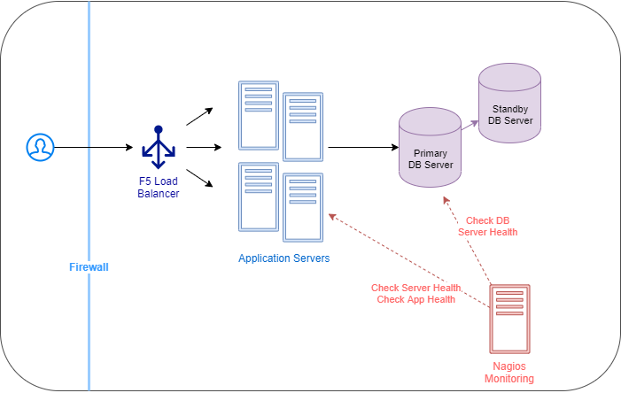
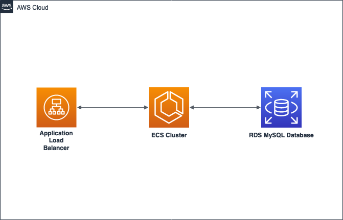

# Provman Application

This directory contains companion source code for the story discussed in our Java Migration blog post series. It deploys
a previously on-premise application to the cloud by containerizing the application and deploying it to AWS's Elastic Container
Service.

Only the architecture, notes on project layout, and installation are contained within this README. For more info on the
application and the process of migrating it to the cloud, please see the following links.

1. [Business Description and On-Prem Architecture](https://medium.com/i-love-my-local-farmer-engineering-blog/how-to-migrate-a-spring-app-to-the-cloud-d04f5155797c)
Explains the application as well as the architecture for the initial on-premise version of the service
   
2. [Picking a Cloud Infrastructure - EC2 and Lambda](https://medium.com/i-love-my-local-farmer-engineering-blog/how-to-migrate-a-spring-app-part-ii-1f755761626e)
A discussion of the tradeoffs of using different cloud infrastructures, mostly focusing on EC2 and Lambda
   
3. [Picking a Cloud Infrastructure - Containers](https://medium.com/i-love-my-local-farmer-engineering-blog/how-to-migrate-a-spring-app-to-the-cloud-part-ii-cf643f3068dd)
A discussion of different container solutions for migrating a Java application that also discusses the final decision to go with Fargate on ECS
   
4. [App2Container and the CDK](https://medium.com/i-love-my-local-farmer-engineering-blog/migrating-java-applications-part-3-app2container-and-the-cdk-3bdf4c3e6328)
Covers working with App2Container in the CDK, as well as the end solution that was used for this application

# Pre-requisites
1. **AWS CLI v2:** with AWS credentials configured (See steps [here](https://docs.aws.amazon.com/cdk/latest/guide/getting_started.html#getting_started_prerequisites))
1. **AWS CDK (v. 1.121.0 or higher):** for infrastructure and code deployment (See installation steps [here](https://docs.aws.amazon.com/cdk/latest/guide/getting_started.html#getting_started_install)
1. **Docker** For bundling code into a Lambda package, as well as generating container images
1. **Java 11** If you haven't installed this version before, you can use [Amazon Corretto 11 distribution](https://aws.amazon.com/corretto/)
1. **Gradle** For building Java code ([Installation step](https://gradle.org/install/))

# Architecture Pre-Migration


# Architecture Post-Migration


# Code Structure
The code contains two folders:

1. "app" folder holds the application code for the Spring MVC API that interfaces with a database through Hibernate
2. "cdk" contains all the code for deploying infrastructure through the Cloud Devlopment Kit including,
    1. A cross-account CI/CD pipeline that will deploy any changes to the application
    2. A database stack that deploys the necessary RDS databases for the application to function
    3. An API stack that will containerize the application and deploy it to an ECS cluster with an Application Load Balancer in front of it
    
# Installation Steps

1. Run `aws configure` to set up your profile and default region.

1. Run `npx cdk bootstrap aws://[AWS_ACCOUNT_ID]/[REGION] --profile <PROFILE_NAME>` if you haven't run it before in the target region.

1. (Windows users only) Your Git client may change line break from LF to CRLF. This will breaks the Gradle build that will happen inside a Docker container (See [details](https://stackoverflow.com/questions/22301956/error-with-gradlew-usr-bin-env-bash-no-such-file-or-directory)). You can check if this is the case for you by running this command:
    ```
   git config --get core.autocrlf
   ```
   If this value is true, open `cdk/gradlew` and change the last line break of the file into LF.

1. Run these commands to deploy:

   Bash on Linux or Mac
    ```
    cd cdk
    rm -rf target ../app/target ./src/main/container/provman.war cdk.out # Remove previous builds
    npx cdk deploy --all --profile <PROFILE_NAME> 
    ```

   Powershell on Windows
    ```
    cd cdk
    rm -r ../app/target # Remove previous app build
    rm -r cdk.out # Remove previous build
    npx cdk deploy --all --profile <PROFILE_NAME> 
    ```

   The deployment can take up to an hour. It will create three CloudFormation stacks. `Pipeline`, `ProvmanDbStack`, and `ProvmanClusterStack`. The stacks are defined in `ProvmanApp.Java` and `ProvmanStage.java` in the CDK code.

   You will be prompted to accept permission changes for each stack in sequence.

   The output of the `ProvmanClusterStack` stack includes a Load Balancer URL for testing. The application can be tested by going to that URL and hitting any endpoint described in the `ProvmanController.java` class.

## Using local AWS CDK CLI
Notice that the example commands use `npx cdk [command]`.

For those who aren't familiar with `npx`, it runs the specified command (`cdk`) through Node Package Manager (npm). `npx` will check first if there is any project-level or local installation of CDK.  If not, it will download CDK with the latest version or exact version (e.g. 1.102.0) if specified and execute it.

You can install CDK in your local machine by running `npm install -g cdk`.  By doing so, you can simply run `cdk` instead. But please note that you will use this version of CDK globally.

We recommend using the same CDK version or higher as the CDK construct libraries (found in `cdk/gradle.build`). This is to avoid issues from incompatible versions.

## Running and developing locally
We have two Gradle projects, `app` and `cdk`. The `cdk` project includes a build script to build `app` so you do not need to build them separately and can deploy everything in a single command (See installation steps).

When you develop this locally, you can get faster cycle of build and unit tests (without deploying anything) by running `./gradlew [target]`. For example:

```
./gradlew test # Run unit tests
``` 

You can also view the generated Cloudformation templates that the `cdk` project creates by running `npx cdk synth` within that directly.
This will forego deploying the resources and allow you to inspect the templates for any specific changes before deploying.

Another useful CDK command line feature is the ability to bypass CI/CD pipeline creation and specify a directory with stack templates
that you wish to deploy directly to an account. This is useful in the situation that you just want to test your stacks, without
having to create an entire pipeline to deploy them. To do this you simply use the `--app` argument to specify the directory
where your generated stack templates are created.

```
npx cdk --app ./cdk.out/assembly-Pipeline-qa deploy --all
```

## CDK Snapshot Testing
Our `cdk` project uses [json-snapshot](https://json-snapshot.github.io/) to perform snapshot testing. The tests are in `ProvmanAppTest.java`.

The test ensures that the CDK code can be successfully synthesized, providing a sanity check before pushing your code. In addition, it generates `ProvmanAppTest.snap` which gets committed to the Git repository. The PR reviewers can check this file to ensure that no unintended changes get introduced in a PR.

When you intentionally change the infrastructure, you have to delete the old snapshot. Otherwise, the tests will fail with a `SnapshotMatchException`.  This project deletes the old snapshot automatically in the task `removeSnapshot` in `cdk/gradle.build` file. Note that the `test` target depends on this, so it is always run before testing and/or building.

We decided to do this to avoid failing the test for every change when developing locally. Your team may decide to remove this task dependency and force developers to remove the snapshot manually as an extra safeguard against making unintended changes in dev accounts.

## Running `cdk diff` before deployment

We **highly** recommend that you run a diff on the resources in your account before deploying when making changes to infrastructure code.
This can be accomplished by running the following command when you have credentials for the account you intend to deploy to,

```npx cdk diff```

This will allow you to see any changes that will occur in your account before you deploy them, potentially preventing any
accidental modifications and/or deletions.