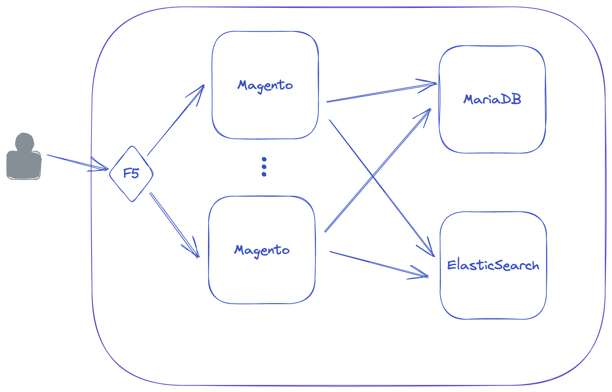
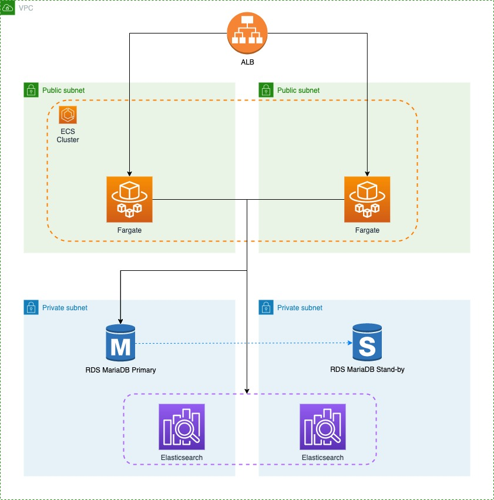

# Containerizing our Magento stack

This directory contains only architecture and installation steps. For more details, please check the [blog] (https://medium.com/i-love-my-local-farmer-engineering-blog/xxxx) 

## Prerequisites
1. **NodeJS (v. 12+)** NodeJS is required for running and installing AWS CDK. You can download it [here](https://nodejs.org/en/download/).
1. **AWS CDK (v. 2.24.1)**: This solution uses AWS CDK for deployment. If you aren't familiar with CDK, please install its [prerequisites](https://cdkworkshop.com/15-prerequisites.html) and follow the  [Java workshop](https://cdkworkshop.com/50-java.html) first.   

## Architecture
To understand what this solution will deploy, we will start from the original architecture.

The on-prem Paris Data Center connects to Paris Office via a lease line, but has VPN connection for other office (as they have lower traffic). The VPN connector cannot scale beyond 50 IPSec clients, so we need to change its architecture to support additional VPN connections from employees.

The solution uses Amazon ECS on Fargate to host the Magento App, Amazon RDS for MariaDB and Amazon Opensearch as dependencies.

### This example is provided as a sample and rely on HTTP, which should never be used in production system.

## Components 

The main components of these solutions are in separate folders:
1. `magento_platform_stack` will set up AWS VPC and Security groups
2. `magento_db_stack` will set up the Amazon RDS for MariaDB.
3. `magento_es_stack` will set up the Opensearch cluster.
4. `magento_app_stack` will set up Amazon ECS cluster on Fargate to host the Magento Application.  

## Installation steps
1. cd MagentoEcsFargate (if not already)
1. cdk deploy --all
2. In CloudFormation console, get the output MagentoHostname from the MagentoAppStack and connect to http://<MagentoHostname>/admin with user/bitnami1 

