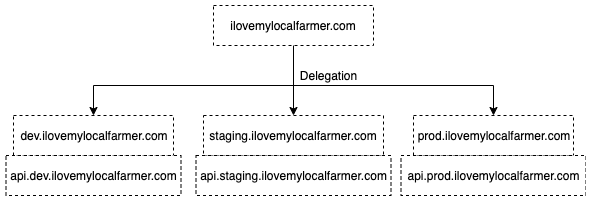
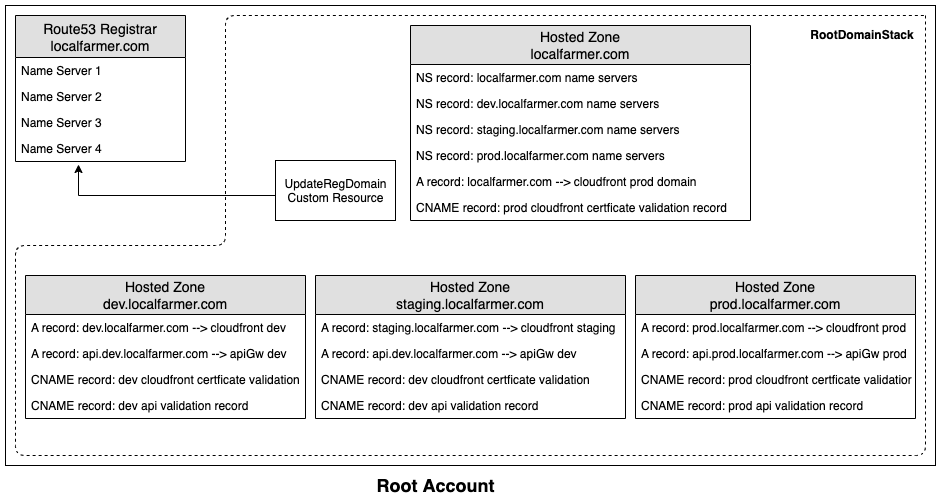
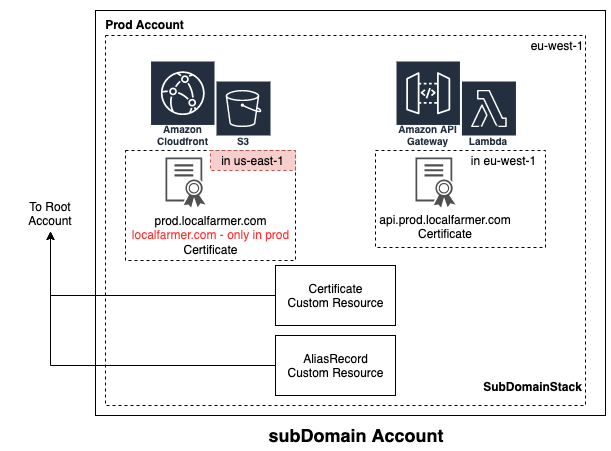

# Multi-Environment Sub-Domain Infrastructure

This solution demonstrates how to create a Sub-Domain setup for Mult-Environment Infrascture, using CDK in Typescript. The solution accompanies [this blog post](https://medium.com/i-love-my-local-farmer-engineering-blog/dns-multi-account-management-using-cdk-6394ef295eee) from the [I Love My Local Farmer Engineering Blog Series](https://medium.com/i-love-my-local-farmer-engineering-blog).

This README.md contains only architecture and installation steps. For more details, please check the blog post

# Pre-requisites

1. **AWS CLI v2:** with AWS credentials configured (See steps [here](https://docs.aws.amazon.com/cdk/latest/guide/getting_started.html#getting_started_prerequisites))
1. **AWS CDK (v. 2.2.0 or higher):** for infrastructure and code deployment (See installation steps [here](https://docs.aws.amazon.com/cdk/latest/guide/getting_started.html#getting_started_install)

# Deployment Steps

update `cdk.json` and replace placeholders for the following:

1. account number and region for each environment
1. domain name

for the root account deploy the RootDomainStack

```
npm run deploy RootDomainStack
```

for the all other accounts (e.g. dev, staring & prod) deploy the SubDomainStack

```
npm run deploy SubDomainStack
```

# Infrastructure

The infrascture will deploy the following DNS delegation setup:



This is how our CDK code will be structured: we will split our Stack into 2 types, first one is the RootDomain Stack which will be deployed to our main root environment and second one is the SubDomain Stack which is re-used and deployed to the rest of our environments (dev, staging & prod)

The RootDomain Stack

This Stack consists mainly of the following Constructs:

* HostedZone responsible for the root domain
* UpdateRegDomain Custom Resource
* 3 HostedZones for each subdomain ( dev, staging & prod )

The root hosted zone is responsible for the root domain ilovemylocalfarmer.com. but this hosted zone will have a list of name servers that don’t match the ones in the registered domain (since we deleted the old hosted zone earlier, remember!). so we created a custom resource to update the registrar with the name servers of our new Hosted Zone.  so what is a Custom Resource ? It is a customisable resource that you can put any code logic in a serverless function, which then is encapsulated as a standalone resource. This gives us the opportunity to add any customised step that is not available through any of the CDK assets available. So what we did is created a function that calls one of the AWS api [UpdateDomainNameservers](https://docs.aws.amazon.com/Route53/latest/APIReference/API_domains_UpdateDomainNameservers.html) to update the registrar.

The remaining hosted zones are responsible for each subdomain. Each one of them will need to create a NS Record in the root hosted zone. so for example when a request comes in for dev.ilovemylocalfarmer.com to the root hosted zone, it won’t know what to do with it. so we need to inform the root hosted zone on how it can reach dev, hence we add the NS record to point to dev hosted zone. This is done for each subdomain hosted zone using the CDK construct [ZoneDelegationRecord](https://docs.aws.amazon.com/cdk/api/v2/docs/aws-cdk-lib.aws_route53.ZoneDelegationRecord.html) ( Constructs are just CDK building blocks that will have logic to create or modify resources ).

This stack will give us an IAM role called crossAccountZoneDelegationRole for each hosted zone which we will share to each subdomain stack. the purpose of this role is to give other accounts the permission to add records in their corresponding HostedZone. so for example `dev.ilovemylocalfarmer.com` in the dev account can share their name servers by adding a NS Record in the Dev HostedZone. so that when a dns request comes in looking for dev subdomain, we know where to point it to.

So basically we have 4 IAM roles:

1. dev delegation role: only allowed to update dev hosted zone for `dev.ilovemylocalfarmer.com`
2. staging delegation role: only allowed to update staging hosted zone for `staging.ilovemylocalfarmer.com`
3. prod delegation role: only allowed to update dev hosted zone for `prod.ilovemylocalfarmer.com`
4. root delegation role: this only allows to update the root hosted zone for ilovemylocalfarmer.com, this will only be given to prod, since only prod will have the the root domain be redirected to it.

Here is a diagram showing what our Root account looks like with our RootDomainStack deployed.

You can see for example all of the records created in the Hosted Zone. The first NS record is for the root domain, which our CustomResource will copy to the Registrar on the left as mentioned. we will go through the purpose of the remaining records in the next Stack, so please bear with me if they don’t make sense yet.

The SubDomain Stack

This Stack consists of the following Constructs:

* Certificate Custom Resource
* App - simple example of a Frontend (CloudFront, s3 Bucket) & Backend (ApiGw & lambda)
* AliasRecord Custom Resource



The same stack is used for each environment (dev, staging & prod ).

Certificate Custom Resource

CDK currently provides a construct called DNSValidatedCertificate. which creates a certificate for your domain e.g `dev.ilovemylocalfarmer.com` and validates it by adding a validation CNAME record to your hosted zone proving you are the owner of this domain name. This would have been perfect and straight forward for all our environments and their subdomains. However we had one big problem we faced. This CDK Construct doesn’t provide any option to validate certificate via DNS if the hosted zone for the domain name is in another account. so this would work fine if we are creating a certificate for `dev.ilovemylocalfarmer.com` as it’s hosted zone is in our dev account. But for an account like prod, where we are planning to associate the root domain (localfarmer.com) as well, we need to update the hosted zone that lives in our Root account. And since DNSValidatedCertificate doesn’t give us this capability. we had to create our own custom resource that gives us this flexibility.

The custom resource contains mainly 2 pieces of logic. first one is the eventHandler that just requests for a new certificate with the domain names. second one is a validation completion handler that does a few things:

1. It waits till certificate has generated the validation details
2. Creates CNAME records with the validation details
3. Waits till certificate has been validated to confirm that you are the owner of the domain

In the prod environment it adds an extra step where it will update the root hostedZone in the rootDomain account to also validate that you are the owner of root domain `ilovemylocalfarmer.com`.

So now that we have this nice construct we will create 2 certificates. one for cloudfront and the other for our api endpoint since we are planning to use a custom api domain. e.g for dev it would be api.`dev.ilovemylocalfarmer.com`.

You might be wondering why 2 certificates ? why not have both domains in one certificate and reuse it for both ? Well that was our initial intention. but we came across this nice puzzle that AWS required us to solve. Cloudfront only accepts certificates in us-east-1 region and ApiGw only accepts certificates in same region it is in. Since our infrastructure is deployed in eu-west-1, we are forced to create 2 certificates to satisfy both requirements.

App

This construct just creates a cloudfront & s3 bucket to hold frontend assets and an ApiGw & Lambda for a simple backend api. Cloudfront in dev will use subdomain `dev.ilovemylocalfarmer.com `and apiGW will use `api.dev.ilovemylocalfarmer.com`. and if we are in prod then cloudfront will also add root domain `ilovemylocalfarmer.com`.

RootAliasRecord Custom Resource

After the cloudfront and ApiGw are created, this Custom Resource adds an Alias record in the corresponding hosted zone to point the subdomain to it. e.g `dev.ilovemylocalfarmer.com` to point to `cloudfront-domain.com` or `api.dev.ilovemylocalfarmer.com` to `api-gateway-endpoint.com`. And you guessed it, it uses the same delegation role passed in from the Root Stack.
